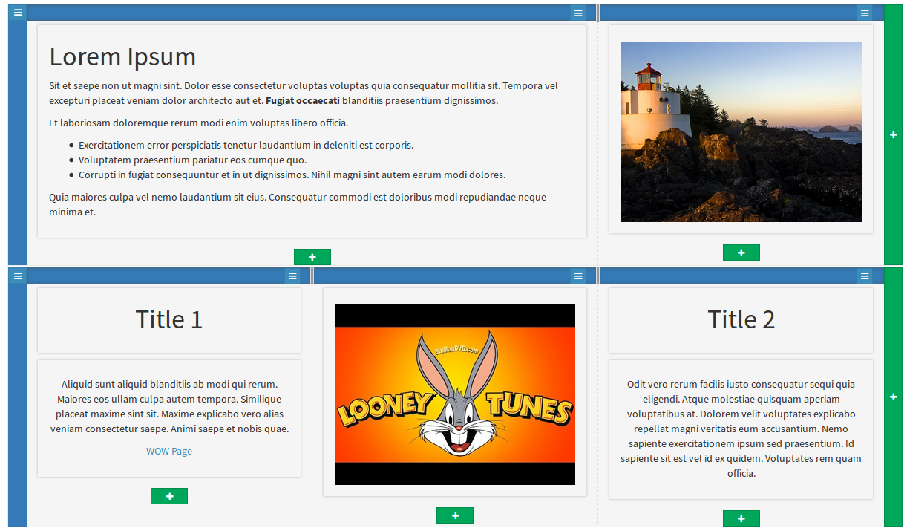
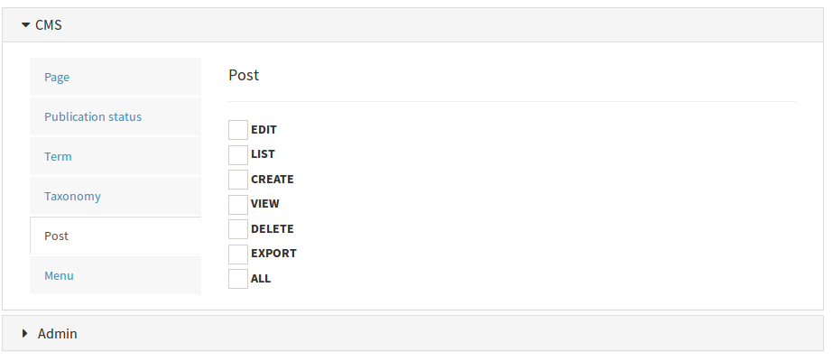
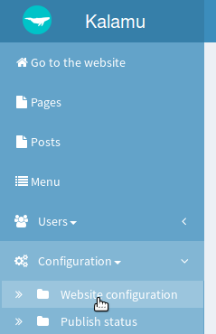

# Kalamu CMS

Kalamu CMS is a Content Management System based on
[Symfony Framework](https://symfony.com/).
This CMS has been made with 3 objectives :

 * Allow a user **without technical knowledge** to edit **any content type**.
From simple text, to images, videos, slider, sections, maps, ...
 * Allow advanced user to edit content with **responsive capabilities**.
 * Keep the **power of Symfony Framework** to allow the development of complex
functionality.


## Main functionalities

### Publish any type of content



The content editor provided with Kalamu CMS is not just a simple text editor.
It's a full interface that allow a **simple user** to add about **every content
type with a few clic**. You can add a text, a video, a map, a form, ...

The editor give you the ability to organize your content with complex shaping.
Advanced users can also configure the behavior on small screens (responsive content)


### Permission configuration



For every actions of the administration interface, there is an associated role.
If the administration of the website is shared with multiple users, it's possible
to restrict the fonctionnalities by group of users (administrators, content
editors, ...)


### Configurable publication status

The publication status are fully configurables. So, you can adjust the status to
your publication workflow.


### Content classification

Published contents can be organized as you want. By tags, categories, projects,
partners, ...or anything you can think about.

Simply create a classification organisation and add your terms. And if you want,
each term has it's one full customizable page to show the contents associated.


## For developers

**Open Source**: All the code is published under the MIT license. This give you
the confidence that CMS is free and will remain forever. This also give you the
right to use it without constraining restrictions (see [license file](LICENSE)).

Full **Symfony application**: it's not only some components, there is no
twisted behaviors. It's a pure Symfony application on witch you can add
seamlessly your bundles.

Possibility to add, without much effort, new content types, change the template,
add new functionalities. Thanks to Symfony, about every parts of Kalamu CMS are
customizable.

The administration interface is based on the well known
[Sonata Admin bundle](https://sonata-project.org/).


## Installation

Start by installing the application :

```sh
composer create-project kalamu/kalamu
cd kalamu/
php app/console doctrine:schema:update --force
php app/console stfalcon:tinymce:symlink
php app/console doctrine:fixtures:load
php app/console cache:clear --env=prod
```

Then got to the administration interface at the `/admin` page.
Default access are:

 * login: **admin**
 * password: **admin**

Before editing your content, you should go to the configuration of the CMS
Start configure your website with the menu "Configuration > Website configuration"



Once you're done with the configuraton, save it and start enjoy the content
edition!